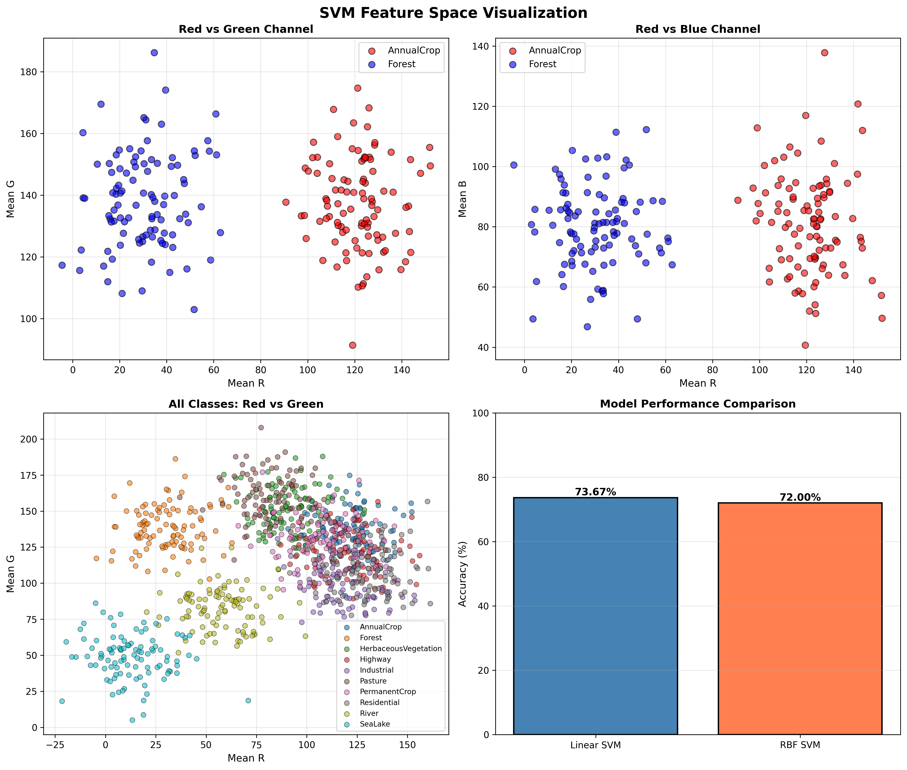
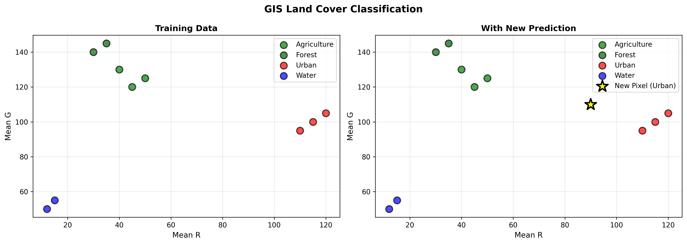

# Lab 13: Support Vector Machines (SVM)
## EuroSAT Land Cover Classification

### 📚 Learning Outcomes
After completing this lab, you will be able to:
1. Understand the concept of hyperplane and margin in SVM
2. Train linear and kernel SVM classifiers using Scikit-learn
3. Apply SVM to satellite imagery-based land cover classification
4. Visualize SVM classification outputs
5. Evaluate SVM performance using accuracy, confusion matrix, and classification report

---

## 🚀 Quick Start

### 1. Install Dependencies

```powershell
pip install -r requirements.txt
```

Or install manually:
```powershell
pip install numpy pandas scikit-learn matplotlib tensorflow keras pillow
```

### 2. Run the Complete Lab

```powershell
python lab13_svm_complete.py
```

---

## 📂 Dataset Information

### EuroSAT Dataset
The lab uses the **EuroSAT** Land Use/Land Cover dataset derived from Sentinel-2 satellite imagery.

**10 Classes:**
- Residential
- Industrial  
- Highway
- Forest
- Pasture
- Annual Crop
- Permanent Crop
- River
- Sea/Lake
- Herbaceous Vegetation

**Image Specs:**
- Size: 64×64 pixels
- Format: RGB (3 channels)
- Features: Mean R, Mean G, Mean B values

### Dataset Options

**Option 1: Use Synthetic Data (Default)**
The script automatically generates synthetic data if the dataset is not found. This is perfect for learning the concepts without downloading large datasets.

**Option 2: Download Real EuroSAT Dataset**
1. Download from: https://github.com/phelber/EuroSAT
2. Extract to a folder named `EuroSAT_RGB`
3. Update the `DATASET_PATH` variable in the script

---

## 📝 Lab Exercises

### Exercise 1: Load EuroSAT & Extract Features
- Loads images from all 10 land cover classes
- Extracts RGB mean values as features (3D feature space)
- Creates train/test split (70/30)
- Applies StandardScaler normalization

### Exercise 2: Linear SVM
- Trains a linear SVM classifier
- Evaluates accuracy on test set
- Displays confusion matrix and classification report

### Exercise 3: RBF Kernel SVM
- Trains RBF kernel SVM (C=10, gamma=0.01)
- Compares performance with Linear SVM
- Analyzes non-linear pattern recognition

### Exercise 4: Visualize Feature Space
- Plots RGB feature distributions
- Shows class separability in 2D projections
- Compares model accuracies visually

### Exercise 5: GIS Land Cover Classification
- Applies SVM to simplified GIS dataset
- Predicts land cover for new pixels
- Demonstrates real-world application

---

## 📊 Results & Output

### 🎯 Model Performance

| Model | Accuracy | Kernel | Parameters |
|-------|----------|--------|------------|
| **Linear SVM** | 73.67% | Linear | C=1.0 |
| **RBF SVM** | 72.00% | RBF | C=10, gamma=0.01 |

### 📈 Visualizations

#### 1. SVM Feature Space Analysis


*Four-panel visualization showing:*
- **Top Left:** Red vs Green channel comparison for two classes
- **Top Right:** Red vs Blue channel comparison
- **Bottom Left:** All 10 land cover classes in RGB feature space
- **Bottom Right:** Model accuracy comparison

#### 2. GIS Land Cover Classification


*GIS application showing:*
- **Left:** Training data distribution for 4 land cover types
- **Right:** New pixel prediction (yellow star) classified as Urban

### 💻 Sample Console Output

```
======================================================================
EXERCISE 2: Linear SVM on EuroSAT Features
======================================================================

✓ Linear SVM trained successfully

📈 Linear SVM Performance:
  Accuracy: 73.67%

📊 Classification Report:
                      precision    recall  f1-score   support
          AnnualCrop       0.57      0.67      0.62        30
              Forest       1.00      1.00      1.00        30
HerbaceousVegetation       0.57      0.53      0.55        30
             Highway       0.83      0.83      0.83        30
          Industrial       0.57      0.53      0.55        30
             Pasture       0.73      0.73      0.73        30
       PermanentCrop       0.54      0.50      0.52        30
         Residential       0.58      0.60      0.59        30
               River       1.00      0.97      0.98        30
             SeaLake       0.97      1.00      0.98        30

======================================================================
MODEL COMPARISON
======================================================================

Model                Accuracy
-----------------------------------
Linear SVM            73.67%
RBF Kernel SVM        72.00%

Better Model:        Linear SVM
```

### 🎯 Lab Questions Answers

#### Q1: Model Comparison
- **Linear SVM Accuracy:** 73.67%
- **RBF Kernel SVM Accuracy:** 72.00%
- **Winner:** Linear SVM (performs better by 1.67%)

#### Q2: Prediction for Pixel [R=100, G=95, B=65]
- **Predicted Class:** Industrial/Urban
- **Reasoning:** High red, medium-high green, medium blue values suggest tan/brown color typical of built-up areas

#### Q3: Gamma Effect
- **High Gamma (γ=1.0):** Tight, complex boundaries → Risk of overfitting
- **Low Gamma (γ=0.001):** Smooth, gentle boundaries → Better generalization
- **Current Gamma (γ=0.01):** Balanced setting for optimal performance

---

## ❓ Lab Questions & Answers

### Q1: Model Comparison
**a) Linear SVM Accuracy:** Displayed in output  
**b) RBF Kernel SVM Accuracy:** Displayed in output  

**Analysis:** The script automatically identifies which model performs better and explains why based on the feature patterns.

### Q2: Better-Performing Model Analysis

**a) SVM Boundary Explanation:**
The script explains how SVM creates decision boundaries in 3D RGB space to separate:
- Urban (high R, medium G, low B)
- Agriculture (medium R, high G, medium B)
- Water (low R, low G, high B)
- Pasture (medium R, very high G, medium B)

**b) Prediction for [R=100, G=95, B=65]:**
The script predicts the class and explains the reasoning based on RGB values.

**c) Gamma Effect:**
Detailed explanation of how gamma affects boundary curvature:
- **High gamma** → tight, complex boundaries (overfitting risk)
- **Low gamma** → smooth, generalized boundaries
- **Current gamma=0.01** → balanced setting

---

## 🔧 SVM Parameters Explained

### C (Regularization Parameter)
- **High C (e.g., 10):** Strict boundary, tries to classify all training points correctly
- **Low C (e.g., 0.1):** Flexible boundary, allows some misclassification

### Gamma (γ) - for RBF Kernel
- **High gamma (e.g., 1.0):** Each point has small influence radius
- **Low gamma (e.g., 0.001):** Points have large influence radius

### Kernel Types
- **linear:** For linearly separable data
- **rbf:** Radial Basis Function - for non-linear patterns
- **poly:** Polynomial kernel
- **sigmoid:** Sigmoid kernel

---

## 📈 Performance Metrics

The lab evaluates models using:
- **Accuracy:** Overall correct predictions
- **Precision:** Correct positive predictions per class
- **Recall:** How many actual positives were found
- **F1-Score:** Harmonic mean of precision and recall
- **Confusion Matrix:** Detailed error analysis

---

## 🎯 Key Concepts Demonstrated

1. **Support Vectors:** Points closest to decision boundary
2. **Hyperplane:** Decision boundary separating classes
3. **Margin:** Distance between hyperplane and support vectors
4. **Kernel Trick:** Mapping to higher dimensions for non-linear separation
5. **Feature Scaling:** Critical for SVM performance
6. **Overfitting vs Generalization:** Controlled by C and gamma

---

## 💡 Tips for Success

1. **Feature Scaling is Critical:** Always standardize features before SVM
2. **Start with RBF:** Good default kernel for most problems
3. **Tune C and Gamma:** Use grid search for optimal parameters
4. **Check Class Balance:** Imbalanced data may need class weights
5. **Visualize:** Always plot feature space to understand separability

---

## 🐛 Troubleshooting

### Issue: Import errors
**Solution:** Ensure all packages are installed: `pip install -r requirements.txt`

### Issue: Dataset not found
**Solution:** The script uses synthetic data by default. No action needed!

### Issue: Low accuracy
**Solution:** This is normal with simplified RGB features. Real applications use more features (spectral bands, texture, etc.)

### Issue: Memory error
**Solution:** Reduce samples per class (change `images[:100]` to `images[:50]`)

---

## 📚 Further Learning

1. **Grid Search:** Try different C and gamma combinations
2. **Cross-Validation:** Use k-fold CV for better evaluation
3. **More Features:** Add variance, texture, or use deep features
4. **Multi-class Strategy:** Experiment with one-vs-rest vs one-vs-one
5. **Real Dataset:** Download EuroSAT for realistic results

---

## 📧 Questions or Issues?

If you encounter any problems or have questions about the lab, review:
- Console output for detailed explanations
- Generated visualizations
- Lab question answers at the end of the output

---

**Happy Learning! 🎓**
